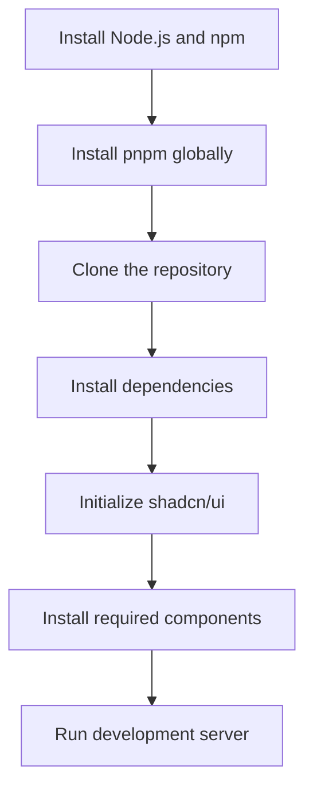

# Simple PDF Merger

A modern, user-friendly web application for merging PDF files with a clean and intuitive interface. Built with Next.js, TypeScript, and Tailwind CSS.

[](https://choosealicense.com/licenses/mit/)
[](CONTRIBUTING.md)

[](https://react.dev)
[](https://nextjs.org/)
[](https://github.com/BjornMelin)
[](https://www.linkedin.com/in/bjorn-melin/)

<!--  -->

## 📚 Quick Links

- [🌟 Features](#-features)
  - [Core Application Features](#core-application-features)
  - [Modern Tech Features](#modern-tech-features)
- [Live Demo](#live-demo)
- [🛠️ Tech Stack](#️-tech-stack)
- [📁 Project Structure](#-project-structure)
- [🚀 Getting Started](#-getting-started)
  - [Prerequisites](#prerequisites)
  - [Installation](#installation)
- [Development](#development)
  - [Type Checking](#type-checking)
  - [Linting](#linting)
  - [Building for Production](#building-for-production)
- [Deployment](#deployment)
  - [Deploy to Vercel](#deploy-to-vercel)
  - [Manual Deployment](#manual-deployment)
- [Troubleshooting](#troubleshooting)
- [Visual Representation](#visual-representation)
- [Contributing](#contributing)
- [👨‍💻 Author](#-author)
- [📜 License](#-license)
- [🌟 Star History](#-star-history)
- [🙏 Acknowledgments](#-acknowledgments)

## 🌟 Features

### Core Application Features

- 📎 **Drag and Drop PDF Files**: Easily add files by dragging and dropping them into the application.
- 📋 **Reorder Files Before Merging**: Arrange the order of your PDF files before merging them.
- 🔄 **Simple and Intuitive Interface**: User-friendly design for a seamless experience.
- 📱 **Responsive Design**: Optimized for all devices, including mobile and tablets.
- 🎯 **File Size Display**: View the size of each PDF file before merging.
- 🗑️ **Easy File Removal**: Quickly remove unwanted files from the list.
- ⚡ **Fast and Efficient**: Merge PDF files quickly with high performance.
- 📱 **Modern Frontend**: Next.js with Tailwind CSS for a sleek and modern look.
- 🛠️ **TypeScript Support**: Strongly typed codebase for improved maintainability.
- 📦 **Component Library**: Utilizes shadcn/ui components for a consistent design.
- 🚀 **Deploy with Vercel**: Easily deploy to Vercel with a single click.

### Modern Tech Features

- ⚡ **React 19 RC Integration**

  - Document Metadata API
  - Asset Loading API
  - Progressive Loading
  - Optimization Compiler

- 🚀 **Next.js 15 App Router**

  - Server Components
  - Partial Prerendering
  - Parallel Routes
  - Edge Runtime

- 🔄 **Full-Stack Type Safety**

  - End-to-end typesafe APIs with tRPC
  - Runtime validation
  - Strict TypeScript
  - Comprehensive error handling

- ⚡ **Performance First**

  - Edge deployment
  - Streaming SSR
  - Smart bundling
  - Optimal caching

## Live Demo

[Visit Simple PDF Merger](https://simple-pdf-merger.vercel.app)

## 🛠️ Tech Stack

- **Framework**: Next.js
- **Language**: TypeScript
- **Styling**: Tailwind CSS
- **Components**: shadcn/ui

## 📁 Project Structure

```plaintext
simple-pdf-merger/
├── app/
│   ├── components/
│   │   └── PDFMerger.tsx      # Main PDF merger component
│   ├── globals.css            # Global styles
│   ├── layout.tsx             # Root layout with metadata
│   └── page.tsx               # Home page
├── components/
│   └── ui/                    # shadcn/ui components
│       ├── button.tsx
│       └── card.tsx
├── lib/
│   └── utils.ts               # Utility functions
├── public/
│   └── screenshot.png         # App screenshot
├── types/
│   └── pdf.ts                # Type definitions
└── package.json
```

## 🚀 Getting Started

### Prerequisites

- Node.js 18.17 or later
- pnpm (recommended), npm, or yarn

### Installation

1. Clone the repository:

    ```bash
    git clone https://github.com/BjornMelin/simple-pdf-merger.git
    cd simple-pdf-merger
    ```

2. Install `pnpm` if you don't have it:

    ```bash
    npm install -g pnpm
    ```

3. Install dependencies:

    ```bash
    pnpm install
    ```

4. Set up shadcn/ui components:

    ```bash
    pnpm dlx shadcn@latest init
    ```

    Choose the following options when prompted:

    - TypeScript: Yes
    - Style: Default
    - Base color: Slate
    - Global CSS: [globals.css](http://_vscodecontentref_/2)
    - CSS variables: Yes
    - tailwind.config.js location: tailwind.config.js
    - Components import alias: @/components
    - Utilities import alias: @/lib/utils

5. Install required shadcn/ui components:

    ```bash
    pnpm dlx shadcn@latest add card button
    ```

6. Run the development server:

    ```bash
    pnpm run dev
    ```

7. Open [http://localhost:3000](http://localhost:3000) in your browser.

## Development

### Type Checking

```bash
npm run type-check
```

### Linting

```bash
npm run lint
```

### Building for Production

```bash
npm run build
```

## Deployment

### Deploy to Vercel

1. Push your code to GitHub
2. Go to [Vercel](https://vercel.com)
3. Import your repository
4. Deploy

### Manual Deployment

Build the application:

```bash
npm run build
```

The build output will be in the `.next` directory.

## Troubleshooting

If you encounter the error `'pnpm' is not recognized as an internal or external command, operable program or batch file`, follow these steps:

1. **Ensure Node.js and npm are installed**:
    - Download and install Node.js from [nodejs.org](https://nodejs.org/).
    - Verify the installation:

      ```bash
      node -v
      npm -v
      ```

2. **Install `pnpm` globally**:
    - Run the following command to install `pnpm`:

      ```bash
      npm install -g pnpm
      ```

3. **Verify `pnpm` installation**:
    - Check the `pnpm` version:

      ```bash
      pnpm -v
      ```

4. **Run the command again**:
    - Use `pnpm dlx` to ensure the latest version is used:

      ```bash
      pnpm dlx shadcn@latest init
      ```

## Visual Representation



## Contributing

1. Fork the repository
2. Create your feature branch (`git checkout -b feature/AmazingFeature`)
3. Commit your changes (`git commit -m 'Add some AmazingFeature'`)
4. Push to the branch (`git push origin feature/AmazingFeature`)
5. Open a Pull Request

## 👨‍💻 Author

### Bjorn Melin

[](https://www.credly.com/org/amazon-web-services/badge/aws-certified-solutions-architect-associate)
[](https://www.credly.com/org/amazon-web-services/badge/aws-certified-developer-associate)
[](https://www.credly.com/org/amazon-web-services/badge/aws-certified-ai-practitioner)
[](https://www.credly.com/org/amazon-web-services/badge/aws-certified-cloud-practitioner)

AWS-certified Solutions Architect and Developer with expertise in cloud architecture and modern development practices. Connect with me on:

- [GitHub](https://github.com/BjornMelin)
- [LinkedIn](https://www.linkedin.com/in/bjorn-melin/)

Project Link: [https://github.com/BjornMelin/simple-pdf-merger](https://github.com/BjornMelin/simple-pdf-merger)

## 📜 License

This project is licensed under the MIT License - see the [LICENSE](LICENSE) file for details.

## 🌟 Star History

[](https://star-history.com/#bjornmelin/simple-pdf-merger&Date)

## 🙏 Acknowledgments

- [Next.js](https://nextjs.org/)
- [Tailwind CSS](https://tailwindcss.com/)
- [shadcn/ui](https://ui.shadcn.com/)
- [Lucide Icons](https://lucide.dev/)

<div align="center">
    <strong>Built with React 19 RC + Next.js 15 by Bjorn Melin</strong>
</div>
